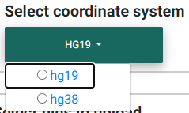
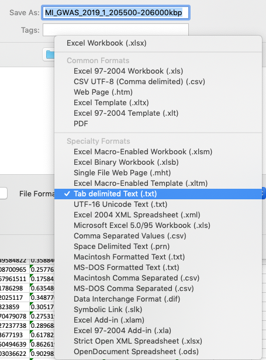
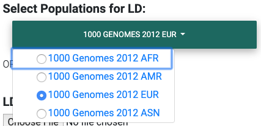

.. _quick_start:

##################
Quick Start
##################

This section provides a quick guide to preparing the required input files for colocalization analysis with LocusFocus.

Up to three files may be selected and uploaded, with a maximum combined file size of 100MB:

#. .txt or .tsv (required): tab-separated primary summary statistics (eg. GWAS)
#. .ld (optional): PLINK-generated LD matrix -- must have the same number of SNPs as primary file
#. .html (optional): Secondary datasets to test colocalization with.

  * For uploaded secondary datasets, each data table must be preceded by an <h3> title tag describing the table 
  * You may use the `merge_and_convert_to_html.py <https://github.com/naim-panjwani/LocusFocus/blob/master/merge_and_convert_to_html.py>`_ script to ready your files for uploading  
  * Press and hold the Ctrl/Cmd key to select multiple files  

***************************************
Selecting the human coordinate system
***************************************

   Selecting the appropriate human genome coordinate system.

Before you begin, you must choose the appropriate human coordinate system for accurate visualization of the data 
in the colocalization plot, accurate matching with GTEx data (if selected), and accurate matching with the
1000 Genomes data for LD calculations (unless a custom matrix is uploaded). hg19 refers to the GRCh37 and 
hg38 to the GRCh38. 

You may ignore this step if your purpose is to simply compute the colocalization between two datasets that you 
upload. In that case, simply ensure the secondary dataset(s) have been prepared using the 
`merge_and_convert_to_html.py <https://github.com/naim-panjwani/LocusFocus/blob/master/merge_and_convert_to_html.py>`_ script or
the `merge_and_convert_to_html_coloc2.py <https://github.com/naim-panjwani/LocusFocus/blob/master/merge_and_convert_to_html.py>`_ script
if also running COLOC2.

***************************
Primary dataset input
***************************

**Please note that use of the web tool requires uploading your summary statistics to a public server.**

The primary dataset will usually be a genome-wide association study (GWAS) file with summary statistics. 
You may download our `sample dataset <https://github.com/naim-panjwani/LocusFocus/blob/master/data/sample_datasets/MI_GWAS_2019_1_205500-206000kbp.tsv>`_  
for meconium ileus around *SLC26A9* gene.

A tab-delimited text file input is preferred. 

The first few lines of a sample input file are shown below.

.. code-block:: console
   :caption: *Example of a few lines of a tab-delimited input file*

   > head MI_GWAS_2019_1_205500-206000kbp.tsv

   #CHROM	BP	SNP	REF	ALT	BETA	SE	P	AF	N
   1	205500022	rs114114637	C	A	-0.0739321001603956	0.152350860711495	0.627481118153097	0.0260753323485968	6770
   1	205500203	rs11240506	A	T	-0.028580509980184	0.0720691836942088	0.691684232909143	0.123175036927622	6770
   1	205500342	rs76069011	C	T	0.269353170260049	0.246838504548712	0.275179551742949	0.0104350073855244	6770
   1	205500450	rs45495498	C	G	-0.253245978881793	0.252113050092583	0.31514069034813	0.0127828655834564	6770
   1	205500543	rs11240507	T	C	0.0546597433178092	0.0555106475800506	0.324785538604616	0.256992614475628	6770
   1	205500586	rs146709978	C	G	0.184819472593451	0.219156490990298	0.399048427185569	0.0155140324963072	6770
   1	205500719	rs74142375	T	A	0.312872957911176	0.227488579712488	0.169027675607645	0.013301329394387	6770
   1	205500767	rs3838999	G	GA	-0.0717111663499279	0.152168074740335	0.637453014437489	0.0259283604135894	6770
   1	205500829	rs3795547	C	T	-0.00434473636812393	0.12753158044846	0.972822985458176	0.0379985228951256	6770

Simple Sum Colocalization
===========================

For the Simple Sum method, two columns are absolutely necessary: 

1. **ID** - The SNP rs id or chrom_pos_ref_alt_build format (e.g. 1_205860191_A_G_b37).
2. **P** - The association p-value 

In this case, you must check the box "Use marker ID column to infer variant position and alleles" 
to map the provided rs ID's to the chromosomal position and alleles using dbSNP.  

Alternatively, for more accurate matching of alleles, 
all four fields (chromosome, basepair position, reference and alternate alleles)
may be provided in addition to the ID column field.

1. **ID** - The SNP rs id or chrom_pos_ref_alt_build format (e.g. 1_205860191_A_G_b37)  
2. **#CHROM** - The chromosome column (either “X” or “23” is acceptable)  
3. **POS** - The basepair position (in hg19 coordinates)  
4. **REF** - The reference allele (on the plus strand, as defined in the 1000 Genomes)  
5. **ALT** - The alternate allele (on the plus strand, as defined in the 1000 Genomes)  
6. **P** - The association p-value  

Use the web form to change the column names as found in your file if different from the default names.
For the example above, you would change the position column default name (POS) to *BP* and MAF to *AF*.  

COLOC2 Colocalization
========================

To run COLOC2, check the box "Add required inputs for COLOC2".
For this option, additional fields are required, and the corresponding required fields 
will be populated to allow for input of the column names if other than default:

1. **BETA** - The beta of the SNP in the association analysis  
2. **SE** - The standard error of beta  
3. **N** - The total sample size of the study  
4. **MAF** - The minor allele frequency  
5. **Study type** - Select either quantitative or case-control.  

For the case-control case, you are required to provide the number of cases in the study.  

If you have a csv or excel file, see below on :ref:`how to convert it to a
tab-delimited file<Formatting the primary dataset file input>`.

We recommend having a dense set of SNPs for the region in order to obtain accurate results.
If the number of SNPs in the region of interest is too small, it may not be possible to compute
the Simple Sum p-value.  

Formatting the primary dataset file input
=============================================

The simplest way to convert either csv or excel file formats is to open the file
in Excel, then choose to save the file as a tab-delimited file.

   Formatting your csv or Excel file as a tab-delimited file using Excel.

Non-default column names
===========================

Use the web form to change the column names as found in your file if different from the default names.
For the example above, you would change the position column default name (POS) to *BP* and MAF to *AF*.  

.. figure:: _static/column_names.png
   :align: center
   :target: _static/column_names.png
   :alt: Input fields to change default column names in primary dataset file input
   :figclass: borderit

   Changing default column names to correspond to input file header names.

***************************
Selecting an LD matrix
***************************

You may either: 

* :ref:`Select the appropriate 1000 Genomes population for your study from the dropdown <Selecting a publicly available 1000 Genomes population LD matrix>`.
* :ref:`Compute the LD matrix from your population<Computing the LD matrix from your GWAS population>`.

For the most accurate colocalization statistics, we recommend uploading the LD matrix of your study. 
If this is unavailable, you may select the most appropriate 1000 Genomes population subset for your study.

Selecting a publicly available 1000 Genomes population LD matrix
===================================================================

hg19
--------

   Selecting the most appropriate 1000 Genomes population (hg19).

These datasets were obtained from `LocusZoom <http://locuszoom.org/>`_.
However, for more accurate results, we suggest :ref:`computing and uploading the LD matrix
for your GWAS study<Computing the LD matrix from your GWAS population>`. 

The 1000 Genomes population dataset `(phase 1, release 3) <ftp://ftp.1000genomes.ebi.ac.uk/vol1/ftp/release/20110521/>`_ consists of:

- EUR: European population of 379 individuals  

  * 85 CEU - Utah Residents (CEPH) with Northern and Western European Ancestry  
  * 93 FIN - Finnish in Finland  
  * 89 GBR - British in England and Scotland  
  * 14 IBS - Iberian Population in Spain  
  * 98 TSI - Toscani in Italia  

- AFR: African population of 246 individuals  

  * 61 ASW - Americans of African Ancestry in SW USA  
  * 97 LWK - Luhya in Webuye, Kenya  
  * 88 YRI - Yoruba in Ibadan, Nigeria  

- ASN: Asian population of 286 individuals  

  * 97 CHB - Han Chinese in Beijing, China  
  * 100 CHS - Southern Han Chinese  
  * 89 JPT - Japanese in Tokyo, Japan  

- AMR: Ad Mixed American population of 181 individuals  

  * 60 CLM - Colombians from Medellin, Colombia  
  * 66 MXL - Mexican Ancestry from Los Angeles USA  
  * 55 PUR - Puerto Ricans from Puerto Rico  

Descriptions of the population codes can be found in the `IGSR: The International Genome Sample Resource <https://www.internationalgenome.org/category/population/>`_.
Also, please note that the `known cryptic relationships in the 1000 Genomes <ftp://ftp.1000genomes.ebi.ac.uk/vol1/ftp/release/20110521/README.sample_cryptic_relations>`_ were not removed for the non-European populations.

hg38
------

.. figure:: _static/LD_1kg_hg38.png
   :align: center
   :target: _static/LD_1kg_hg38.png
   :alt: Dropdown of available 1000 Genomes (phase 1, release 3) populations for LD computation
   :figclass: borderit

   Selecting the most appropriate 1000 Genomes population (hg38).

The hg38 version of the `1000 Genomes population <https://www.internationalgenome.org/announcements/Variant-calls-from-1000-Genomes-Project-data-calling-against-GRCh38/>`_
is computed from a fully realigned call set against GRCh38. The biallelic SNV call set is used and more details are available on the 
`1000 Genomes Project FTP site <http://ftp.1000genomes.ebi.ac.uk/vol1/ftp/data_collections/1000_genomes_project/release/20181203_biallelic_SNV/>`_.  

A total of 2,548 individuals are available on the 1000 Genomes, and 2,507 have been assigned a population and super-population code.
The distribution of populations available for selection on the app are as follows:  

- EUR: European population of 502 individuals  

  * 99 CEU - Utah Residents (CEPH) with Northern and Western European Ancestry
  * 89 GBR - British in England and Scotland
  * 107 IBS - Iberian Population in Spain
  * 111 TSI - Toscani in Italia
  * 96 FIN - Finnish in Finland

- NFE: Non-Finnish European (406 individuals)

- AFR: African population of 671 individuals

  * 97 ACB - African Caribbeans in Barbados
  * 61 ASW - Americans of African Ancestry in SW USA
  * 100 ESN - Esan in Nigeria
  * 113 GWD - Gambian in Western Divisions in the Gambia
  * 103 LWK - Luhya in Webuye, Kenya
  * 90 MSL - Mende in Sierra Leone
  * 107 YRI - Yoruba in Ibadan, Nigeria

- AMR: Ad Mixed American population of 333 individuals  

  * 92 CLM - Colombians from Medellin, Colombia
  * 64 MXL - Mexican Ancestry from Los Angeles USA
  * 85 PEL - Peruvians from Lima, Peru
  * 92 PUR - Puerto Ricans from Puerto Rico

- EAS: East Asian population of 509 individuals  

  * 100 CDX - Chinese Dai in Xishuangbanna, China	
  * 106 CHB - Han Chinese in Beijing, China
  * 99 CHS - Southern Han Chinese
  * 105 JPT - Japanese in Tokyo, Japan
  * 99 KHV - Kinh in Ho Chi Minh City, Vietnam

- SAS: South Asian population of 492 individuals  

  * 106 GIH - Gujarati Indian from Houston, Texas
  * 102 ITU - Indian Telugu from the UK
  * 96 PJL - Punjabi from Lahore, Pakistan
  * 102 STU - Sri Lankan Tamil from the UK

Computing the LD matrix from your GWAS population
======================================================

Before you compute the LD matrix, please ensure that the number and order of SNPs matches that of the 
original uploaded GWAS or primary dataset file. 

The easiest way to compute the LD from your own population is using `PLINK <https://www.cog-genomics.org/plink/1.9/ld>`_. 

Assuming your GWAS dataset is in binary PLINK format (ie. bed/bim/fam fileset), 
and you have `subset the region <http://zzz.bwh.harvard.edu/plink/dataman.shtml#extract>`_,
an example run would be:

.. code-block:: console 
   :caption: *Example PLINK command for calculating the LD matrix*

   plink --bfile <plink_filename> --r2 square --make-bed --out <output_filename>

In the above command, please replace plink_filename and output_filename with appropriate substitutes.

******************************************************
Secondary datasets
******************************************************

All 48 :ref:`GTEx (v7)<Datasets>` (hg19) and 49 :ref:`GTEx (v8)<Datasets>` tissues are provided for selection as secondary datasets 
to test colocalization with. The genes found in the coordinates 
entered (:ref:`GENCODE v19 (hg19) or GENCODE v26 (hg38)<Datasets>`) can be chosen for colocalization testing 
(thus, the number of secondary datasets and 
colocalization tests performed is the number of tissues selected times the number of genes selected in the region).

In addition to GTEx tissues, several user-specified datasets may be uploaded as a merged HTML file.
For further instructions on how to :ref:`create a merged HTML file<Formatting custom secondary datasets>`, see the section below.

Alternatively, you may skip selection of GTEx tissues altogether and only focus on 
the colocalization tests for your uploaded secondary dataset(s). Please note that you *can* have both custom and
GTEx datasets analyzed as secondary datasets.

Selecting GTEx tissues as secondary datasets
======================================================

You may select all the necessary tissues to test colocalization with your primary dataset. 
Computation times, however, increase the more tissues and genes you select, so please be selective here if possible.
Most colocalization analyses will finish within 10-15 minutes, but a gene-rich region may take 30 minutes or longer to compute.

Also note that computing a large number of Simple Sum p-values is computationally demanding for a web server, 
and doing so may delay or prevent others from accessing the website. In a later release, we plan to add a queue system for a better experience.

Formatting custom secondary datasets
======================================================

In order for LocusFocus to recognize a dataset as secondary and perform colocalization testing, 
you must format your dataset in HTML format.
The HTML format allows several datasets to be merged in a single HTML file. We suggest each dataset 
be preceded by an <h3> tag with the description title of the dataset.

We provide a `python script <https://github.com/naim-panjwani/LocusFocus/blob/master/merge_and_convert_to_html.py>`_ 
to simplify the generation of the merged HTML dataset. To run both Simple Sum and COLOC2, please use the
`merge_and_convert_to_html_coloc2.py <https://github.com/naim-panjwani/LocusFocus/blob/master/merge_and_convert_to_html.py>`_ script.

The first step in creating the HTML file is to create a tab-separated `descriptor file <https://locusfocus.research.sickkids.ca/static/archive/slc26a9_uk_biobank_spirometry_files_to_merge.txt>`_
containing the list of files to be merged together (first column). The second column (tab-delimited) 
may contain descriptions of the datasets. 
The remaining columns specify the column names for chromosome, basepair position, SNP name, P-value (in that order).

For example, suppose we had three `genomewide association analyses (from Ben Neale) from the UK Biobank <https://docs.google.com/spreadsheets/d/1kvPoupSzsSFBNSztMzl04xMoSC3Kcx3CrjVf4yBmESU/edit?ts=5b5f17db#gid=227859291>`_:

#. `Forced vital capacity (FVC) - 3062 <https://locusfocus.research.sickkids.ca/static/archive/3062.assoc.mod.ROI.slc26a9.tsv>`_
#. `Forced expiratory volume in 1-second (FEV1) - 3063 <https://locusfocus.research.sickkids.ca/static/archive/3063.assoc.mod.ROI.slc26a9.tsv>`_
#. `Peak expiratory flow (PEF) - 3064 <https://locusfocus.research.sickkids.ca/static/archive/3064.assoc.mod.ROI3.slc26a9.tsv>`_

The first few lines for FVC look as follows:

.. code-block:: console
   :caption: *Few lines of a tab-delimited FVC association analysis file from Ben Neale's analysis of the UK Biobank*

   > head 3062.assoc.mod.ROI.slc26a9.tsv

   variant	rsid	nCompleteSamples	AC	ytx	beta	se	tstat	pval	chr	pos
   1:205860191:A:G	rs149104610	307638	7.58684e+03	2.89852e+02	-1.06502e-02	9.01042e-03	-1.18199e+00	2.37211e-01	1	205860191
   1:205860462:G:A	rs183927606	307638	7.58336e+03	2.94623e+02	-1.03192e-02	9.01499e-03	-1.14467e+00	2.52347e-01	1	205860462
   1:205860763:T:C	rs182878528	307638	7.57953e+03	2.92349e+02	-1.04035e-02	9.01627e-03	-1.15386e+00	2.48558e-01	1	205860763
   1:205860874:A:G	rs573870089	307638	1.06676e+03	6.36134e+01	2.08202e-02	2.49968e-02	8.32914e-01	4.04894e-01	1	205860874
   1:205861028:G:A	rs36039729	307638	4.44225e+04	2.35233e+03	9.40215e-04	3.81097e-03	2.46713e-01	8.05131e-01	1	205861028
   1:205861107:C:T	rs9438396	307638	2.85296e+04	1.97301e+03	9.23118e-03	4.68786e-03	1.96917e+00	4.89347e-02	1	205861107
   1:205861225:G:A	rs115170053	307638	5.08637e+03	3.62211e+02	6.28049e-03	1.11434e-02	5.63607e-01	5.73022e-01	1	205861225
   1:205861433:G:C	rs6670490	307638	2.88292e+04	1.99373e+03	8.56608e-03	4.66254e-03	1.83721e+00	6.61794e-02	1	205861433
   1:205862075:T:C	rs6665183	307638	2.18993e+04	1.26147e+03	1.50666e-04	5.70059e-03	2.64299e-02	9.78914e-01	1	205862075

*Note that we modified the original file by adding the chromosome and position columns*

The FEV1 and PEF phenotype association files look similar.

To merge the summary statistics from these three files into a merged HTML file, we would first create a 
`descriptor file <https://locusfocus.research.sickkids.ca/static/archive/slc26a9_uk_biobank_spirometry_files_to_merge.txt>`_ 
of all the files we would like to merge. See below for the case of combining these three files:

.. code-block:: console
   :caption: *Description file of all the secondary dataset files we would like to merge into an HTML file*

   > cat slc26a9_uk_biobank_spirometry_files_to_merge.txt

   3062.assoc.mod.ROI.slc26a9.tsv	Forced vital capacity (FVC) - 3062	chr	pos	rsid pval
   3063.assoc.mod.ROI.slc26a9.tsv	Forced expiratory volume in 1-second (FEV1) - 3063	chr	pos	rsid	pval
   3064.assoc.mod.ROI3.slc26a9.tsv	Peak expiratory flow (PEF) - 3064	chr	pos	rsid	pval

Each column (tab-separated) defines:

1. Filename
2. Description title
3. Chromosome column name
4. Basepair coordinate position column name
5. rs ID column name (alternatively, you may specify a column with variant ID formatted as chrom_pos_ref_alt_b37; e.g. 1_205860191_A_G_b37)
6. P-value

Then, to generate the merged html file while subsetting the region we may issue the command as follows:

.. code-block:: console
   :caption: *Example command to merge three summary statistic datasets into an HTML file using merge_and_convert_to_html.py*

   > python3 merge_and_convert_to_html.py slc26a9_uk_biobank_spirometry_files_to_merge.txt 1:205860000-205923000 slc26a9_uk_biobank_spirometry_merged.html

A description of the positional arguments may be issued with the -h or --help arguments:

.. code-block:: console
   :caption: *Description of positional arguments for merge_and_convert_to_html.py script*

   > python3 merge_and_convert_to_html.py -h

   usage: merge_and_convert_to_html.py [-h]
      filelist_filename coordinates outfilename

   Merge several datasets together into HTML tables separated by <h3> title tags

   positional arguments:
      filelist_filename  Filename containing the list of files to be merged
                     together. The second column (tab-delimited) may contain
                     descriptions of the datasets. The remaining columns
                     specify the column names for chromosome, basepair
                     position, SNP name, P-value (in that order).
      coordinates        The region coordinates to subset from each file (e.g.
                     1:500,000-600,000
      outfilename        Desired output filename for the merged file

   optional arguments:
      -h, --help         show this help message and exit

The above command will generate the merged 
`slc26a9_uk_biobank_spirometry_merged.html <https://locusfocus.research.sickkids.ca/static/archive/slc26a9_uk_biobank_spirometry_merged.html>`_, 
file which can be used with LocusFocus.

******************************************************
Some important points to consider
******************************************************

- Please note that your GWAS and secondary datasets must be subset in order to reduce the file size for uploading purposes (current combined limit is 100 MB). 
- You must also enter the genomic location you are interested in the *HG19 Coordinates* field. The format must be *chromosome:start-end*, where *start* is the starting basepair position and *end* is the ending basepair position. 
- The region size entered in *Coordinates* field cannot be larger than 2 MBbp. 
- If the SNP column has multiple rsid's separated by semicolon, the first rsid will be used. 
- The SNP rs id is not used for determining the presence of the SNP in the 1000 Genomes population for the LD calculation; the chromosome and position columns determine this. If the chromosome:position combination is found in the 1000 Genomes, then the pairwise LD will be calculated for that particular SNP. 
- The LD matrix is calculated for chromosome:position SNPs available in both GWAS input and the selected 1000 Genomes population datasets. 
- Only overlapping SNPs are used for the Simple Sum calculations, and only overlapping SNPs with the primary dataset are plotted. 
- A region within +/- 0.1 Mbp is selected around the top SNP to compute the Simple Sum p-value. This area is shaded gray in the first plot. This is done for each gene found within +/- 1 Mbp of the top SNP for all the tissues selected. 
- It is important to have a dense set of genotyped SNPs to get an accurate assessment of the Simple Sum p-value calculation. 

