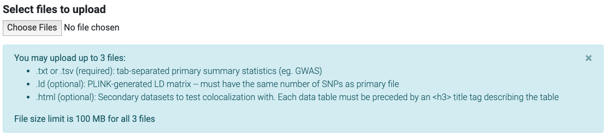
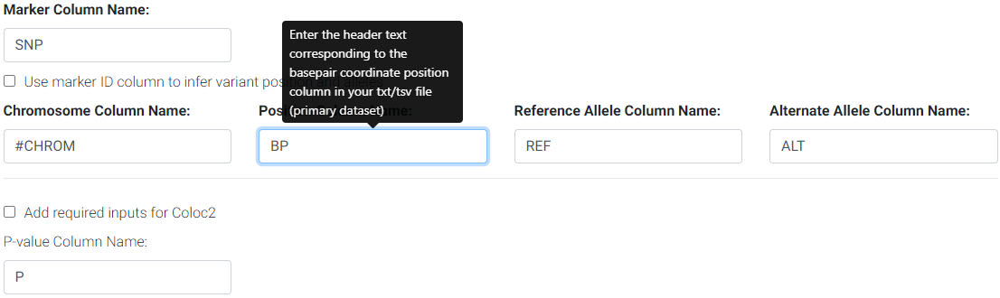
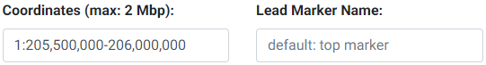
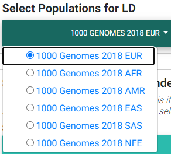
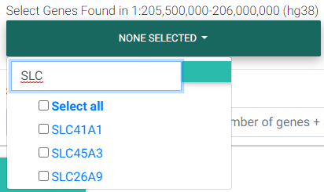
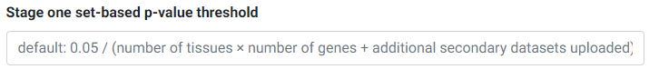
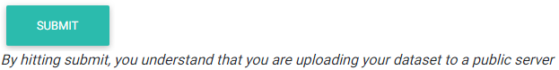
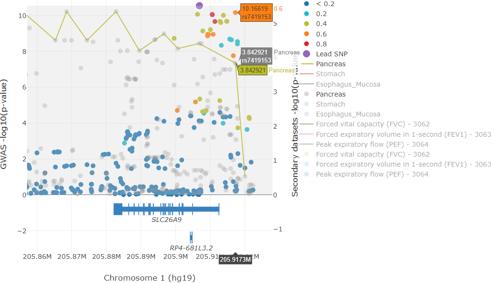
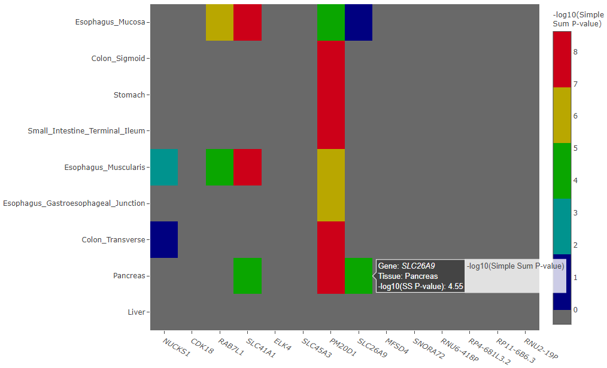

.. _examples:

######################################################
Example Run, Usage and Interpretation
######################################################

Here we show an example run using the 
`GWAS summary statistics for meconium ileus <https://github.com/naim-panjwani/LocusFocus/blob/master/data/sample_datasets/MI_GWAS_2019_1_205500-206000kbp.tsv>`_ 
around the *SLC26A9* association locus as the primary dataset, and its colocalization with nearby genes in GTEx tissues.

***************************
Sample Data and Output
***************************

You may follow along by downloading the `sample data for meconium ileus <https://github.com/naim-panjwani/LocusFocus/blob/master/data/sample_datasets/MI_GWAS_2019_1_205500-206000kbp.tsv>`_.
The output after a run using this dataset can be accessed by entering the `session ID 0d074aff-76f4-42ab-87ef-5e2fa34b04e8 <https://locusfocus.research.sickkids.ca/session_id/0d074aff-76f4-42ab-87ef-5e2fa34b04e8>`_ 

1. Click on "Choose File" to upload the GWAS summary statistics. As stated, the file must be tab-delimited and not exceed 100MB.

   Upload button allows for uploading multiple files

- This step allows uploading multiple files. Two additional files may be uploaded here (optional):

  - :ref:`A PLINK-generated .ld matrix file for your sample population<Computing the LD matrix from your GWAS population>`
  - :ref:`An HTML file of secondary datasets<Formatting custom secondary datasets>`

2. Next, if your GWAS summary statistics have column names that differ from the defaults, you may enter them in the respective columns.

   Enter the column names for your primary/GWAS dataset

3. Enter the region to subset and, optionally, enter a lead marker name. 
The format of the region must be chr:start-end. The region cannot be more than 2 Mbp wide. 
This input field is checked for errors and a message will appear below it if an inappropriate entry is made.
The coordinates specified here are used to look up the genes available (GENCODE v19 for hg19 and GENCODE v26 for hg38) for colocalization testing using GTEx.
The marker string entered must match the string in the SNP column of the uploaded GWAS file. 
If no marker is chosen, then the top SNP (with lowest P-value) will be automatically used.
If the top SNP does not match an entry in the 1000 Genomes, the next best SNP will be automatically chosen.

*********************************************
Selecting LD (Linkage Disequilibrium)
*********************************************

Please see the section on :ref:`selecting an LD matrix<Selecting an LD matrix>`.
In brief, you can select one of the 1000 Genomes populations LD structure, or upload the LD structure for your population. 
We recommend users calculate the LD matrix for the uploaded region for their population for more accurate results.
You may download the matrix for this example `here <https://locusfocus.research.sickkids.ca/data/sample_datasets/MI_GWAS_2019_1_205500-206000kbp.ld>`_.
For this example, we selected the 1000 Genomes European population instead.

   Selecting most appropriate 1000 Genomes population (ignored if uploading .ld file)

In the image above,

- EUR: European population
- AFR: African population
- AMR: Ad Mixed American population
- EAS: East Asian population
- SAS: South Asian population
- NFE: Non-Finnish European

The LD matrix file must have the same number and order of SNPs as the GWAS summary statistics file.

For details on the populations available for LD calculations in either hg19 or hg38 builds, see the section
on :ref:`Selecting a publicly available 1000 Genomes population<Selecting a publicly available 1000 Genomes population LD matrix>`

*********************************************
Selecting Secondary Datasets from GTEx
*********************************************

In the dropdown, we list all 48 tissues analyzed by `GTEx v7 (hg19) <https://gtexportal.org>`_ 
or 49 tissues for `GTEx v8 (hg38) <https://gtexportal.org>`_.

**Please note that while we allow the ability to select all the tissues, this increases the amount of time 
for computing all Simple Sum p-values due to the number of gene-tissue pairs at a particular genomic region.**

You may search through these tissues in the search box provided in the dropdown. Please note that the search
is case-sensitive and that all tissue names start with a capital letter.

.. figure:: _static/select_gtex_tissues.png
   :alt: GTEx tissues dropdown menu with search
   :target: _static/select_gtex_tissues.png
   :align: center
   :figclass: borderit

   Selecting appropriate tissues for colocalization testing from the `GTEx Project <https://gtexportal.org>`_.

**********************************************************
Selecting Genes of Interest for Colocalization Testing
**********************************************************

The next field requests for selecting genes found in the region that was entered previously in the *Coordinates* field. 
Colocalization testing is performed on the eQTL data for the gene/tissue pairs selected. 

**Please note that colocalization testing is computationally demanding and may take some time to complete if 
selecting many gene/tissue pairs.**

   Selecting genes found in the region of interest

**********************************************************
Overriding the First-Stage Set-Based P-value Threshold
**********************************************************

The Simple Sum method first assesses which secondary/eQTL datasets pass a first-stage significance test. 
The threshold for this passing this test is set at the Bonferroni level (0.05 divided by the number of secondary datasets).
If you would like to override this p-value threshold, you may enter your desired threshold in the input field.

For example, if you selected 3 tissues and 4 genes for testing, 
and uploaded 3 other secondary datasets, you have a total of 3 × 4 + 3 = 15 secondary datasets or tests for the first stage.
The default Bonferroni-corrected p-value threshold of 0.05 / 15 = 0.0033 will be used for first stage significance testing. 
Secondary datasets that pass the first stage threshold undergo colocalization testing in the next stage.

   Overriding the first-stage set-based Bonferroni p-value threshold

************************
Submit
************************

Good job! You are now ready to hit Submit!

Please click the submit button just once.
Depending on how many tissues and tissues you have selected, 
the process may take anywhere from a few minutes up to 30-45 minutes 
for a gene-rich region with all tissues selected.

************************************
Saving and Retrieving Your Session
************************************

After the program has computed the colocalization tests, the page will refresh to show
the plots and a session ID on top of the page.

Please save this session ID string for your records in order to retrieve the page without 
running the full computation again. See `session retrieval <./session_retrieval.html>`_ for help on this.

*********************************************
Interpreting Data Output
*********************************************

Colocalization plot
====================

Plots are generated using `Plotly <https://plot.ly/javascript/>`_. 

The first plot that is generated consists of: 

- The GWAS p-values uploaded with the lead marker used as reference to
  show the degree of pairwise LD with the lead marker. These are shown as circles.
  The color pattern is similar to that followed by LocusZoom, where the strength of 
  r\ :sup:`2` with the lead marker is broken down by the following color-coding scheme:

  * dark blue circles - low LD (< 0.2)
  * light blue circles - LD between 0.2-0.4
  * green circles - LD between 0.4-0.6
  * orange circles - LD between 0.6-0.8
  * red circles - high LD greater than 0.8
  * the purple circle (slightly larger than the rest) is the lead marker
  * gray circles are markers that could not be found in the 1000 Genomes (phase 1, release 3)

- Lines showing the (rough) eQTL p-value patterns followed for the particular gene and tissues selected.

  * These lines are connected by taking the lowest p-value in a moving window.
  * The size of these windows varies according to the size of the region entered as follows:

    - Region size (in basepairs) divided by 100,000 then times 15 (i.e. (regionsize/100,000) * 15)

- Circles (hidden by default) to show the eQTL data for the user-entered gene and tissues. 
  This is the underlying raw data used to draw the (rough) line patterns.

  * To show these circles, simply click on the corresponding tissue name in the legend for
    which you would like to observe the eQTL data for.

- A gray-shaded region that spans approximately 100 Kbp on each side of the lead marker.
  Markers that fall in this shaded region are used for calculating the Simple Sum p-values.
  Note that while only markers in this shaded region are used for the Simple Sum p-value calculation,
  all genes that fall in the region entered get a Simple Sum value computed for them using the markers in this shaded region 
  (i.e. while the gene may be far away from the shaded region, markers in the shaded region may fall in a *cis*-regulatory
  element that influences the expression of that gene).

- If there are genes in the region, the collapsed gene transcript model is shown under the plot. 
  An attempt is made to display the gene name under or above the gene. 
  However, if there are many genes in the region, some text is hidden to avoid crowding.
  If that's the case, one can always hover over the start, end or middle of the gene to display the gene name in a tooltip.

`Plotly <https://plot.ly/javascript/>`_ has several functionalities to permit the interactive exploration of the
plot. On top of the plot, you will notice a toolbar to allow for several functions. 

Some of the functions of this toolbar include saving the plot,
zooming, panning, selection tools, and data exploratory tools such as spike lines and vertical data point comparisons
(e.g. if you have the GWAS and eQTL circles shown, you may select the "Compare data on hover" and compare 
the same association p-values for the GWAS and eQTL SNPs simultaneously - see example figure below).

   Example colocalization plot illustrating the "compare data on hover" feature of plotly_.

.. _plotly: https://plot.ly/javascript/

In the example image above, we find a particular top GWAS SNP (rs7419153) 
that also has a high -log\ :sub:`10` eQTL P-value in the Pancreas. To get this result, simply zoom 
into the `example session <https://locusfocus.research.sickkids.ca/session_id/0d074aff-76f4-42ab-87ef-5e2fa34b04e8>`_,
click on the "Compare data on hover" tool, and hover over the SNPs (if the SNP data is dense, it is easier to
first zoom in and show only the top GWAS hits - you could deselect the SNPs with low LD by clicking on the legend).
The y-axes can be rescaled by clicking and dragging at the corners; clicking and dragging the y-axes from the middle repositions the zero line.

Interpreting the Heatmap Plot
====================================

The heatmap plot shows the -log\ :sub:`10` Simple Sum P-values and their *relative* strength compared to
all the other GTEx gene-tissue pairs for the session. If the Simple Sum p-value could not be calculated for a particular
gene-tissue pair, it will show as a negative number. 

Reasons for reporting a negative number are further broken down in three cases and 
an :ref:`interactive table<Simple Sum Table>` output below the heatmap describes the exact reason.

   Example heatmap plot of -log\ :sub:`10` Simple Sum p-values

Simple Sum Table
=============================

The -log\ :sub:`10` Simple Sum colocalization p-values are reported for the gene-tissue pairs that passed the 
first stage set-based test for significance (after Bonferroni correction by default, unless overriden by the user).

There are three cases in which colocalization p-values may not be calculated, and each of those particular cases
is given a negative numeric value as described below:

  - -1 value is given to gene-tissue pairs with no eQTL data (usually due to little or no expression)
  - -2 value is given to gene-tissue pairs that did not pass the Bonferroni-corrected first stage testing for signficance among the secondary datasets chosen
  - -3 value is given to gene-tissue pairs where the Simple Sum P-value computation failed, likely due to insufficient SNPs

At this stage, it is up to each study to determine a reasonable p-value threshold to determine if a particular Simple Sum p-value
should be considered significant. A conservative approach would be to take a Bonferroni-corrected threshold where the alpha level is 
divided by the number of tests performed (i.e. the number of gene-tissue pairs and other uploaded datasets that passed the first-stage test of significance).
For example, if a user selected 3 tissues and 4 genes for testing, and 3 other secondary datasets 
(a total of 3 × 4 + 3 = 15 tests) and among these, 6 datasets passed the first-stage test and were tested for colocalization, 
then one would conservatively choose to consider a Bonferroni-corrected p-value threshold of :math:`0.05 \div 6 = 8.3 \times 10^{-3}` for a 0.05 alpha level. 

If you have uploaded custom secondary datasets, a separate interactive table is output below the GTEx's Simple Sum interactive table.

COLOC2 Posterior Probability Results Table
============================================

If you opted to run COLOC2, the posterior probabilities for H4 (the most directly comparable to the Simple Sum - see `bioRxiv`_ paper) are
output in an interactive table. 

.. _bioRxiv: https://plos.figshare.com/articles/Results_of_Simple_Sum_colocalization_and_contrasting_colocalization_analyses_for_the_three_meconium_ileus_genome-wide_significant_loci_and_colocalization_posterior_probabilities_from_COLOC_and_eCAVIAR_/7772168/1

