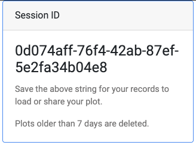

.. _session_retrieval:

####################################
Retrieving a Previous Session
####################################

Every session that is submitted and run can be quickly retrieved without the need 
to re-run the entire analysis again. These sessions are saved for 7 days or longer.

To do so, you must copy and store the session ID string that is given at the top right
corner of the output page. An example is shown below.

To retrieve the session, simply click on the `Session ID <https://locusfocus.research.sickkids.ca/previous_session>`_ button on the `main page <https://locusfocus.research.sickkids.ca/>`_.

And then paste the session ID string in the input form and click submit.

As an example, you can try submitting `session ID 0d074aff-76f4-42ab-87ef-5e2fa34b04e8 <https://locusfocus.research.sickkids.ca/session_id/0d074aff-76f4-42ab-87ef-5e2fa34b04e8>`_

The example above will bring the plots associated with the 
GWAS association results for meconium ileus, a complication in cystic fibrosis patients
where newborns experience bowel obstruction at birth due to thick meconium, and assesses the *SLC26A9* gene
eQTLs for each relevant digestive tract tissue from GTEx (version 7). The heatmap 
provides an overview of the strength of colocalization using the Simple Sum p-value across the digestive tissues and 
all the genes found within 1 Mbp of the top SNP in the region.

